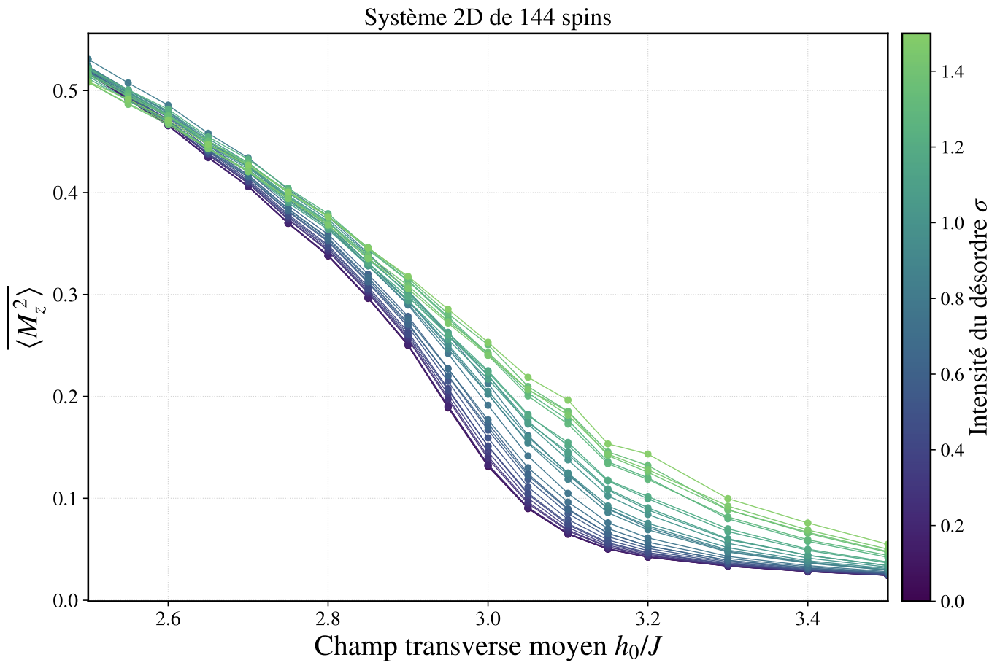
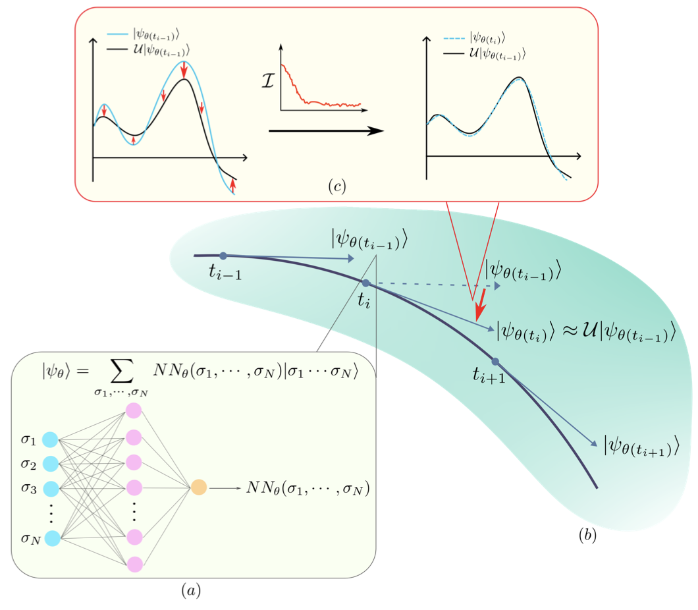

I always accept spontaneous candidatures for 2nd year _Projets scientifiques collectifs_ (**PSC**) and 3rd year _Projets de recherche en laboratoire_ (**PRL**) on topics related to my research.
I don't formally advertise one because the projects with me require an high motivation level. 

## PRL

- 2024, [Evan Wonisch: Variational Monte Carlo Algorithms for Finding Ground States](../assets/documents/prl/2024-wonisch-prl.pdf)

## PSC

For the PSC, working with me requires understanding the basics of many-body quantum physics (systems with many particles), of statistical physics concepts like phase transitions and of deep learning. Students at the start of the second year master neither of those concepts, which are loosely treated in later courses. This means that the beginning (first ~2 months) of PSC will be dedicated to studying those things, understanding them, and implementing algorithms to tackle the problems that arise in those problems.

Projects with me are _research driven_: it means that the objective is to identify a small problems and to investigate it. I don't know if the problem is solvable a priori, but it will be fun to learn how to do research to understand it and solve it, or prove it can't be solved.

My life motto is probably _work hard, party harder_.  The motto of a PSC with me is probably _work hard, learn harder_ (or, chatGPT proposes the fun _high effort, higher returns_). AKA, i will put a lot of effort in to teach you stuff and help you, but you have to put in the effort, otherwise this won't work.

To get an idea of what past students did, here are some projects:

### 2025/26: Étude de systèmes de spins fortement corrélés désordonnés au moyen d’états quantiques neuronaux

Ce PSC étudie l’influence du désordre sur la transition de phase ferromagnétique-paramagnétique du modèle d’Ising transverse (1D/2D), afin de mieux modéliser les matériaux réels. Nous surmontons la complexité ex- ponentielle du problème à N corps via une approche numérique pionnière optimisant des États Quantiques Neuronaux (RBM, CNN, Transformers) par Monte Carlo Variationnel.  Ces méthodes, validées sur le cas sans désordre, approximent l’état fondamental de systèmes complexes, inaccessible aux techniques exactes classiques.

[Click here to access the final report](../assets/documents/psc/2025-final.pdf)

### 2023/24: Simulation Quantique Neuronale Adaptative

[Click here to access the final report](../assets/documents/psc/2023-final.pdf)

